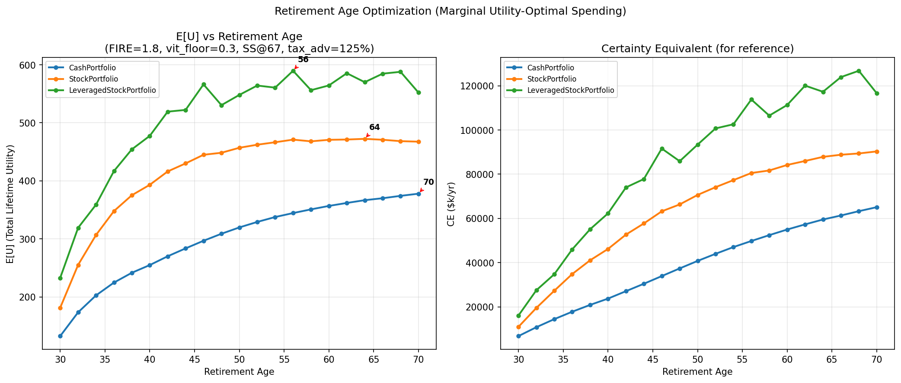
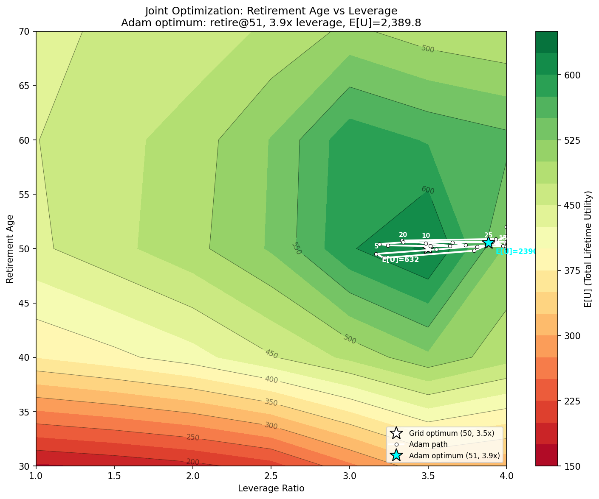
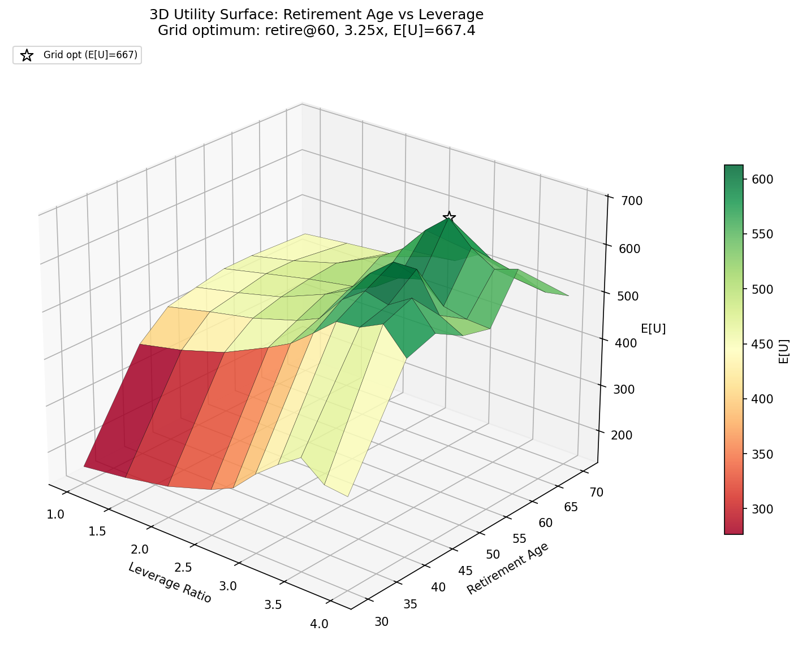
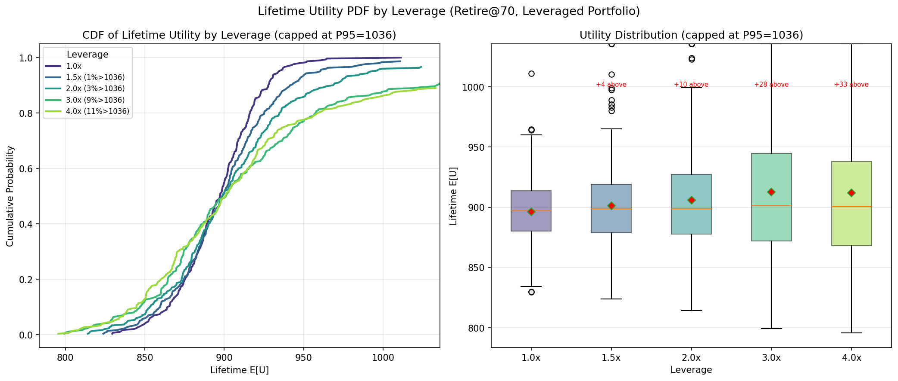

# Financial-Planning

A Monte Carlo retirement simulator that answers: **"When can I retire, and how much can I spend?"**

Compares three portfolio strategies — cash, stocks, and leveraged stocks — over a configurable lifetime, using lifecycle spending rules that adapt to market conditions, vitality (health/energy decline with age), and Social Security.

Heavily inspired by the principles of Ben Felix.

## Architecture

The simulator has three composable layers:

1. **Financial Model** — stochastic market simulation (Vasicek bond yields, equity returns with fat tails, stochastic volatility, stock-bond correlation)
2. **Decision Model** — spending rules that determine how much to consume each year (fixed, lifecycle amortized, or marginal utility-optimal)
3. **Utility Model** — CRRA power utility with FIRE multiplier and vitality weighting, used to score and compare outcomes

## Example Output

### Retirement Age Optimization


### Joint Optimization: Retirement Age vs Leverage




### Utility Distribution by Leverage


## Quick Start

```bash
pip install -r requirements.txt

# (Optional) Set up your personal profile
cp .env.example .env
# Edit .env with your income, expenses, net worth, etc.

# Single simulation
python retirement_math.py

# Monte Carlo (500 sims, plots confidence intervals)
python retirement_math.py --monte-carlo 500

# Find optimal retirement age (the main use case)
python retirement_math.py --retirement-sweep 500
```

## Personal Configuration

Copy `.env.example` to `.env` and customize with your own financial profile. The `.env` file is gitignored and never committed.

| Variable | Description | Example |
|----------|-------------|---------|
| `RETIREMENT_AGE` | Target retirement age | `45` |
| `INITIAL_NET_WORTH` | Current net worth ($1k units) | `200` |
| `INITIAL_EXPENSES` | Annual expenses ($1k units) | `60` |
| `SPENDING_FLOOR` | Minimum annual spending ($1k units) | `45` |
| `STATE_TAX_RATE` | State income tax rate | `0.13` |
| `INCOME_SCHEDULE` | Comma-separated income per working year ($1k) | `100,100,120,120,...` |
| `ONE_TIME_EXPENSES` | `age:amount` pairs, comma-separated | `30:150,35:40,...` |

CLI flags always override `.env` values.

## Key Concepts

### Vitality Curve
Health and energy decline with age. The vitality function `v(age)` models this as a Gaussian decay from a peak age, with a floor representing baseline capacity. This causes the spending rule to **front-load consumption into high-vitality years** — spend more at 35, less at 80.

### FIRE Multiplier
Retirement years are worth more than working years (freedom, autonomy). The FIRE multiplier inflates utility during retirement: `U = fire_mult * v(age) * c^α`. Higher values pull the optimal retirement age earlier.

### Social Security
SS benefits are computed from the full formula (AIME over top 35 earning years, PIA bend points, FRA adjustment). **FIRE reduces SS** — retiring after 12 years of work yields ~$18k/yr vs ~$32k/yr for 35+ years. The spending rules include PV of future SS when planning.

### Spending Floor
The marginal utility-optimal rule can front-load spending aggressively toward high-utility years. The spending floor reserves PV of a guaranteed minimum, then the excess is allocated via Euler equation optimization: `c_t ∝ (w_t / d^t)^γ` where `γ = 1/(1-α)`. Default floor $30k/yr.

### Retirement Tax Advantage
Retirement withdrawals (LTCG at ~15%, Roth at 0%) are taxed much less than earned income (~38%). The `retirement_tax_advantage` multiplier (default 1.25x) inflates the real purchasing power of portfolio wealth after retirement.

## Simulation Modes

### Single Run
```bash
python retirement_math.py --seed 42
```
One simulation path with year-by-year output. Good for understanding the mechanics.

### Monte Carlo
```bash
python retirement_math.py --monte-carlo 1000
```
Runs N simulations, plots net worth trajectories with confidence bands for each portfolio type.

### Retirement Age Sweep
```bash
python retirement_math.py --retirement-sweep 500
```
The main optimization mode. Sweeps retirement ages from 30-70, runs N sims per age, and plots certainty-equivalent (CE) spending vs retirement age. Automatically uses marginal utility-optimal spending. Shows the optimal retirement age per portfolio type.

### Leverage Sweep
```bash
python retirement_math.py --leverage-sweep 500
```
Sweeps leverage ratios from 1x-3x to find the optimal leverage level.

### 2D Parameter Sweep
```bash
# Retirement age vs leverage contour
python retirement_math.py --sweep-2d retirement-age leverage 200

# ERP vs volatility sensitivity
python retirement_math.py --sweep-2d erp stock-vol 200 --sweep-metric median_ce

# Full quant mode
python retirement_math.py --sweep-2d retirement-age leverage 200 \
    --stochastic-lifespan --stochastic-income --bayesian --antithetic
```
Sweeps any two parameters on a grid, computing CE (or ruin probability) at each point. Produces a filled contour chart with the optimum marked. Supports all quant features.

Available parameters: `retirement-age`, `leverage`, `erp`, `stock-vol`, `fire-multiplier`, `initial-nw`, `spending-floor`, `discount-rate`.

## Quant Features

### MC Variance Reduction
- **`--antithetic`** — Antithetic variates: each seed runs with normal and negated shocks, averaging utilities. Halves variance without doubling compute (at the cost of 2x simulations per seed).
- **Common Random Numbers (CRN)** — All sweep functions pre-generate a seed list and reuse it across parameter values, producing smoother CE curves with less noise.

### Margin Calls
- **`--maintenance-margin 0.25`** — When leveraged equity drops below 25% of prior NW, forced partial liquidation occurs. Leverage is reduced to `margin_call_leverage` (default 1.0x) for a 2-year cooldown, then restored.
- **`--no-margin-calls`** — Disable margin call mechanics (original behavior).

### Stochastic Lifespan (Gompertz Mortality)
- **`--stochastic-lifespan`** — Each simulation draws a death age from the Gompertz mortality model `h(age) = a·exp(b·age)`. Default calibration: median death ~82, P(survive to 95) ~10%.
- Spending rules still plan for `expected_lifespan` (you can't know when you'll die), but the simulation terminates at the sampled death age. This creates realistic **longevity risk**.
- **`--gompertz-a`** (default 0.00003), **`--gompertz-b`** (default 0.085), **`--max-age`** (default 110).

### Stochastic Income (Market-Correlated Job Loss)
- **`--stochastic-income`** — During working years, each year has a probability of job loss: `P(loss) = base · exp(sensitivity · max(0, -excess_return))`. Job loss probability spikes when markets crash.
- **`--job-loss-prob`** (default 0.03), **`--job-loss-sensitivity`** (default 5.0).

### Bayesian Parameter Uncertainty
- **`--bayesian`** — At the start of each MC simulation, sample true market parameters from posteriors: `ERP ~ N(μ, σ²)`, `log(vol) ~ N(log(σ̄), τ²)`, `θ_bond ~ N(θ̄, σ²)`. This captures **estimation risk** on top of market risk.
- **`--bayesian-erp-std`** (default 0.02), **`--bayesian-vol-std`** (default 0.30), **`--bayesian-bond-std`** (default 0.01).

## CLI Reference

### Personal / Timeline
| Flag | Default | Description |
|------|---------|-------------|
| `--start-age` | 25 | Age to start simulation |
| `--retirement-age` | 65 | Retirement age |
| `--lifespan` | 90 | Expected lifespan |
| `--initial-nw` | 50 | Initial net worth ($1k units) |
| `--initial-expenses` | 40 | Initial annual expenses ($1k units) |
| `--spending-floor` | 30 | Minimum annual spending ($1k units) |

### Market Model
| Flag | Default | Description |
|------|---------|-------------|
| `--erp` | 0.025 | Equity risk premium |
| `--stock-vol` | 0.10 | Annualized equity volatility |
| `--bond-yield` | 0.02 | Initial real bond yield (≈ TIPS rate) |
| `--margin-spread` | 0.015 | Broker spread above bond yield for leverage |

### Portfolio
| Flag | Default | Description |
|------|---------|-------------|
| `--leverage` | 2.0 | Leverage ratio for leveraged portfolio |
| `--maintenance-margin` | 0.25 | Margin call equity threshold |
| `--no-margin-calls` | — | Disable margin call mechanics |

### Simulation Mode
| Flag | Default | Description |
|------|---------|-------------|
| `--monte-carlo N` | 0 | Run N Monte Carlo sims (0 = single run) |
| `--retirement-sweep N` | 0 | Sweep retirement ages with N sims per age |
| `--leverage-sweep N` | 0 | Sweep leverage ratios with N sims per level |
| `--sweep-2d P1 P2 N` | — | 2D sweep of two parameters with N sims/point |
| `--sweep-metric` | mean_ce | Metric: `mean_ce`, `median_ce`, `ruin_pct` |
| `--sweep-portfolio` | leveraged | Portfolio to score: `cash`, `stock`, `leveraged` |
| `--seed` | random | Random seed for reproducibility |
| `--antithetic` | — | Enable antithetic variates for variance reduction |

### Spending Rule
| Flag | Default | Description |
|------|---------|-------------|
| `--amortized` | — | Use lifecycle amortized spending (auto for sweeps) |

### Utility Model
| Flag | Default | Description |
|------|---------|-------------|
| `--utility-power` | 0.65 | CRRA exponent α in U(c) = c^α |
| `--discount-rate` | 0.03 | Annual time preference δ |
| `--fire-multiplier` | 1.8 | Utility multiplier for retirement years |

### Vitality
| Flag | Default | Description |
|------|---------|-------------|
| `--vitality-peak` | 30 | Age of peak vitality |
| `--vitality-half-life` | 35 | Years from peak to ~63% decay |
| `--vitality-floor` | 0.3 | Minimum vitality (even at 100) |
| `--no-vitality` | — | Disable vitality weighting |

### Social Security
| Flag | Default | Description |
|------|---------|-------------|
| `--no-ss` | — | Disable Social Security |
| `--ss-claiming-age` | 67 | Age to start claiming (62-70) |

### Tax
| Flag | Default | Description |
|------|---------|-------------|
| `--retirement-tax-advantage` | 1.25 | Withdrawal purchasing power multiplier |

### Stochastic Features
| Flag | Default | Description |
|------|---------|-------------|
| `--stochastic-lifespan` | — | Enable Gompertz mortality |
| `--gompertz-a` | 0.00003 | Gompertz baseline hazard |
| `--gompertz-b` | 0.085 | Gompertz aging rate |
| `--max-age` | 110 | Hard upper bound for simulation |
| `--stochastic-income` | — | Enable market-correlated job loss |
| `--job-loss-prob` | 0.03 | Annual baseline job loss probability |
| `--job-loss-sensitivity` | 5.0 | Market crash amplification of job loss |

### Bayesian
| Flag | Default | Description |
|------|---------|-------------|
| `--bayesian` | — | Enable Bayesian parameter uncertainty |
| `--bayesian-erp-std` | 0.02 | Posterior std of equity risk premium |
| `--bayesian-vol-std` | 0.30 | Posterior std of log(volatility) |
| `--bayesian-bond-std` | 0.01 | Posterior std of bond yield |

## Example Workflows

### "When should I retire?"
```bash
# With default profile
python retirement_math.py --retirement-sweep 500

# Customize your profile
python retirement_math.py --retirement-sweep 500 \
    --initial-nw 200 --initial-expenses 60

# With strong FIRE preference
python retirement_math.py --retirement-sweep 500 --fire-multiplier 2.5

# Conservative: no leverage, no SS
python retirement_math.py --retirement-sweep 500 --leverage 1.0 --no-ss
```

### "How much can I spend at each age?"
Run a single sim with amortized spending and inspect the year-by-year output:
```bash
python retirement_math.py --amortized --seed 42
```

### "What leverage should I use?"
```bash
python retirement_math.py --leverage-sweep 500
```

### "What's the joint optimal retirement age and leverage?"
```bash
python retirement_math.py --sweep-2d retirement-age leverage 200
```

### "How do results change with parameter uncertainty?"
```bash
python retirement_math.py --retirement-sweep 500 \
    --stochastic-lifespan --stochastic-income --bayesian --antithetic
```

## Portfolio Strategies

- **CashPortfolio** — earns the real bond yield (≈2%). Safe but low growth.
- **StockPortfolio** — earns bond yield + ERP (≈7%) with stochastic volatility, fat tails, and stock-bond correlation.
- **LeveragedStockPortfolio** — leveraged equities with borrowing costs and margin call mechanics. Default 2x leverage with 25% maintenance margin. Higher expected returns but much higher variance; volatility drag reduces median growth below mean growth. Margin calls force deleveraging during crashes, preventing total wipeout.

## Monetary Units

All values are in **$1,000 units** (2023 USD). An income of `350` means $350,000/year. Output is displayed in full dollar amounts.

## File Structure

All flat files in the project root (no package — `python retirement_math.py` works directly):

| File | Purpose |
|------|---------|
| `retirement_math.py` | CLI entry point (`parse_args` + `main`) |
| `config.py` | `SimulationConfig`, `SimulationResult`, tax/formatting helpers |
| `models.py` | Vitality, Social Security, Vasicek yields, Gompertz, Bayesian sampling |
| `spending.py` | `SpendingRule` ABC, `FixedSpending`, `AmortizedSpending`, `VitalityAmortizedSpending`, `MarginalUtilitySpending` |
| `utility.py` | `UtilityScorer` ABC, `CRRAUtility` |
| `simulator.py` | `run_simulation` — the core financial model |
| `sweeps.py` | Monte Carlo, leverage sweep, retirement sweep, 2D sweep |
| `plotting.py` | All visualization functions (lazy matplotlib import) |
| `portfolio.py` | Portfolio classes (`Cash`, `Stock`, `LeveragedStock`, `PortfolioManager`) |

## Contributing

1. Fork the repo and create a feature branch
2. Key design principles:
   - All monetary values in $1k units
   - Three-layer architecture: Financial Model (`simulator.py`), Decision Model (`spending.py`), Utility Model (`utility.py`) — keep them decoupled
   - Spending rules implement `SpendingRule.compute(ctx: YearContext) -> float`
   - Utility scorers implement `UtilityScorer.score()` and `certainty_equivalent()`
   - New features should add fields to `SimulationConfig` (in `config.py`) and CLI flags in `parse_args()`
3. Test changes with: `python retirement_math.py --retirement-sweep 200` (fast sanity check)
4. Open a PR with a description of what changed and why
