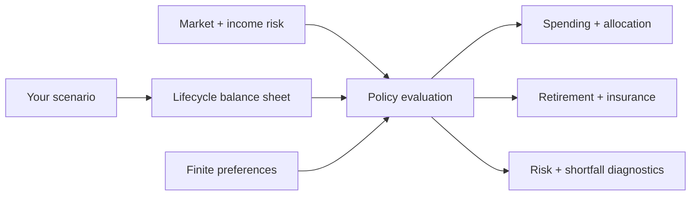

<div align="center">

# lifecycle-finance

### Turn a financial life into a model you can inspect, stress, and change.

[](https://www.python.org/)
[](https://docs.astral.sh/uv/)


A typed Python library for lifecycle balance sheets, retirement simulation, portfolio decisions,
and account-aware implementation.

</div>

Most retirement calculators answer one narrow question with hidden assumptions. `lifecycle-finance`
turns the whole problem—wealth, future earnings, spending, taxes, preferences, markets, and
longevity—into explicit components you can replace and test. Use it to compare policies, understand
trade-offs, and find the assumptions that actually drive a decision.

The core package is offline. Seeded simulations are deterministic for a fixed configuration.

> This software is for research and educational use. It does not provide individualized
> investment, tax, or legal advice.


```mermaid
flowchart LR
    A[Your scenario] --> B[Lifecycle balance sheet]
    M[Market + income risk] --> C[Policy evaluation]
    B --> C
    P[Finite preferences] --> C
    C --> D[Spending + allocation]
    C --> E[Retirement + insurance]
    C --> F[Risk + shortfall diagnostics]
```

## Why try it?

| Instead of… | You can… |
|---|---|
| treating salary and future spending as footnotes | put human capital and consumption liabilities on the balance sheet |
| optimizing only terminal wealth | score spending, retirement freedom, bequests, and risk under one inspectable utility model |
| trusting one smooth return distribution | test persistent regimes, fat tails, rate shocks, and correlated income disruption |
| stopping at a target allocation | model tax lots, account constraints, withdrawals, conversions, and executable rebalancing |
| accepting an opaque recommendation | trace insolvency, funding shortfall, event shortfall, and preference breaches separately |

You can get from clone to a first plan in three commands:

```bash
uv sync
uv run lifecycle-finance example
uv run lifecycle-finance simulate --paths 10000 --seed 42
```

## What it models

- lifecycle balance sheets: financial wealth + human capital − consumption liabilities;
- consumption, retirement, insurance, annuitization, and bequest choices under one utility model;
- human-capital-aware asset allocation and implementable leverage;
- fat-tailed, regime-switching market returns and stochastic income disruption;
- uncertain lifespan and survival-conditioned outcomes;
- taxable, traditional, Roth, and HSA accounts with tax lots and explicit ledgers;
- Roth conversions, withdrawals, rebalancing, and asset location;
- vectorized Monte Carlo evaluation, chunked runs, sweeps, and calibration.

Financial amounts are real dollars unless an API says otherwise. Rates are decimals.

## Install

Python 3.12 or newer is required. With [`uv`](https://docs.astral.sh/uv/):

```bash
git clone https://github.com/SidG2k1/Financial-Planning.git
cd Financial-Planning
uv sync
uv run lifecycle-finance example
```

Optional dependencies are separated by use:

```bash
uv sync --extra plot          # matplotlib and seaborn
uv sync --extra market        # yfinance adapter
uv sync --extra calibration   # pandas and legacy workbook support
uv sync --extra dev           # tests, lint, typing, and coverage
```

## Quick start

```python
from lifecycle_finance import (
    FinancialWealth,
    LifecyclePlanner,
    Person,
    PlanningScenario,
    Sex,
)

scenario = PlanningScenario(
    person=Person(current_age=45, retirement_age=66, sex=Sex.FEMALE),
    wealth=FinancialWealth(
        domestic_equity=200_000,
        global_equity=250_000,
        bonds=600_000,
        cash=150_000,
    ),
)

plan = LifecyclePlanner().plan(scenario)
print(plan.net_worth)
print(plan.constrained_allocation)
```

Domain inputs are immutable and validated. JSON serialization is available for applications,
notebooks, and reproducible scenario files.

The CLI exposes the same library boundaries:

```bash
uv run lifecycle-finance plan
uv run lifecycle-finance simulate --paths 10000 --seed 42
uv run lifecycle-finance simulate \
  --paths 100000 --chunk-size 10000 --summary-only --seed 42
```

## Preferences and decisions

Preferences are finite utility curves, not feasibility constraints. A desired spending floor,
for example, can express a strong dislike of shortfall without making every lower-spending path
mathematically impossible:

```python
from lifecycle_finance import (
    OutcomeType,
    SpendingFloorCurve,
    UtilityAddon,
    UtilityAggregation,
)

spending_preference = UtilityAddon(
    name="basic_spending",
    outcome=OutcomeType.SPENDING,
    curve=SpendingFloorCurve(threshold=40_000, scale=10_000),
    importance=2.0,
    aggregation=UtilityAggregation.DISCOUNTED_MEAN,
)
```

This curve is `0` at and above `$40,000`, `-1` at `$30,000`, and `-4` at `$20,000` before its
importance weight. Hard constraints remain reserved for physical or legal feasibility, such as
limited liability and unavailable account holdings.

The engine reports insolvency, policy-funding shortfall, event shortfall, and preference breaches
separately. A sweep can therefore optimize total utility without disguising why a path performed
poorly.

## Monte Carlo simulation

```python
from lifecycle_finance import (
    LeverageInstrument,
    MonteCarloEngine,
    SimulationSettings,
)

result = MonteCarloEngine().simulate(
    scenario,
    settings=SimulationSettings(
        paths=10_000,
        seed=42,
        leverage=1.5,
        leverage_instrument=LeverageInstrument.BOX_SPREAD,
    ),
)

print(result.summary())
```

The default `RegimeSwitchingMarket` is a three-state multivariate Student-t model for equity,
bonds, cash, and real rates. Normal, growth/deflation-stress, and inflation-stress regimes vary
expected returns, volatility, cross-asset covariance, and joint tails. Unlevered asset returns
respect limited liability.

Each path keeps one fitted hyperparameter scenario for its full horizon, separating parameter
uncertainty from annual shocks. Antithetic pairs share regime and epistemic state while using
opposite continuous shocks. `StochasticMarket` remains available as the legacy compatibility
model:

```bash
uv run lifecycle-finance simulate --paths 10000 --market-model regime
uv run lifecycle-finance simulate --paths 10000 --market-model legacy
```

The path engine is vectorized. Chunked runs bound working memory, but chunk size is part of the
deterministic configuration: the same seed and chunk size reproduce the same run; changing chunk
size intentionally changes child random streams.

### Income disruption

`MonteCarloEngine` accepts an `IncomeRiskModel`. The default models a one-year market-correlated
job loss. Persistent displacement is an explicit alternative:

```python
from lifecycle_finance import MonteCarloEngine, PersistentDisplacementIncomeRisk

income_risk = PersistentDisplacementIncomeRisk(
    baseline_probability=0.02,
    market_sensitivity=4.0,
    probability_cap=0.25,
    income_fractions_after_displacement=(0.50, 0.75, 1.00),
)

engine = MonteCarloEngine(income_risk_model=income_risk)
```

Generated income-risk arrays are path × modeled-year and include realized income, income
fraction, displacement state, and vesting eligibility.

## Supplied paths and custom policies

`PolicyPathEvaluator` evaluates decisions against externally supplied market paths. Policies see
beginning-of-year state and cannot read the current year's returns. This prevents accidental
look-ahead.

```python
import numpy as np

from lifecycle_finance import (
    MarketPaths,
    PlanningScenario,
    PolicyPathContext,
    PolicyPathDecision,
    PolicyPathEvaluator,
    UtilityModel,
)


class FixedPolicy:
    def decide(self, context: PolicyPathContext) -> PolicyPathDecision:
        return PolicyPathDecision(
            external_income=50_000,
            consumption=40_000,
            target_total_equity=0.60,
        )


zeros = np.zeros((2, 2))  # two paths × two return years
market = MarketPaths(
    equity_returns=zeros,
    bond_returns=zeros.copy(),
    cash_returns=zeros.copy(),
    real_rates=zeros.copy(),
)

result = PolicyPathEvaluator(
    UtilityModel.from_scenario(PlanningScenario())
).evaluate(
    market,
    FixedPolicy(),
    candidate_count=1,
    ages=(45.0, 46.0, 47.0),
    exposure=(1.0, 1.0, 1.0),
    initial_liquid_wealth=500_000,
    initial_restricted_equity=100_000,
)
```

Return arrays are path × return-year. Result histories are candidate × path × modeled-year.
`target_total_equity` includes restricted equity; `liquid_equity_weight` describes only the
liquid portfolio.

## Accounts and taxes

Aggregate Monte Carlo wealth and account-level tax-lot projections are separate engines. The
account engine models holdings and taxable events explicitly rather than inferring them from an
aggregate allocation.

```python
from lifecycle_finance import (
    Account,
    AccountPortfolio,
    AccountType,
    Asset,
    TaxLot,
    rebalance_asset_location,
)

assets = {
    "STOCK": Asset("STOCK", "equity", expected_real_return=0.05),
    "BOND": Asset("BOND", "bonds", expected_real_return=0.02),
}
portfolio = AccountPortfolio(
    accounts={
        "401k": Account(
            "401k",
            AccountType.TRADITIONAL,
            [TaxLot("BOND", shares=1_000, basis=100_000, acquired_year=2020)],
            allowed_assets=frozenset(assets),
        )
    },
    prices={"STOCK": 100.0, "BOND": 100.0},
)

rebalance_asset_location(
    portfolio,
    assets,
    {"equity": 0.60, "bonds": 0.40},
    year=2026,
)
```

Sales, withdrawals, conversions, and investment income are recorded in explicit ledgers.
Withdrawals and Roth conversions distinguish requested, executed, and shortfall amounts. The tax
model is intentionally incomplete; see [`MODEL_NOTES.md`](MODEL_NOTES.md) before relying on a
policy result.

## Model boundaries

- `LifecyclePlanner` defaults to `WorkbookSocialInsurance` for workbook compatibility. Pass
  `SocialSecurityPolicy` when claim-age-aware behavior is required.
- `with_config()` replaces an entire market configuration. Use `with_config_overrides()` to
  preserve model-specific calibration while changing named fields.
- The bundled [`workbook_scenario.json`](examples/workbook_scenario.json) is a compatibility
  fixture, not a recommended household plan.
- The checked-in regime constants are fitted offline to annual US real returns through 2025.
  Simulation performs no download or recalibration.
- Network access exists only in explicit adapters such as `YFinancePriceProvider`.

Read [`ARCHITECTURE.md`](ARCHITECTURE.md) for module ownership and extension points, and
[`MODEL_NOTES.md`](MODEL_NOTES.md) for formula choices, calibration semantics, tax omissions, and
compatibility behavior.

## Development

```bash
uv sync --extra dev
uv run ruff check src tests
uv run mypy src
uv run pytest -q
```

When changing packaging, exports, or dependencies, also run:

```bash
uv build
```

Personal scenarios, generated reports, documentation workspaces, and binary artifacts are ignored
by repository policy. Keep reusable behavior in `src/lifecycle_finance/` and observable behavior
tests in `tests/`.
